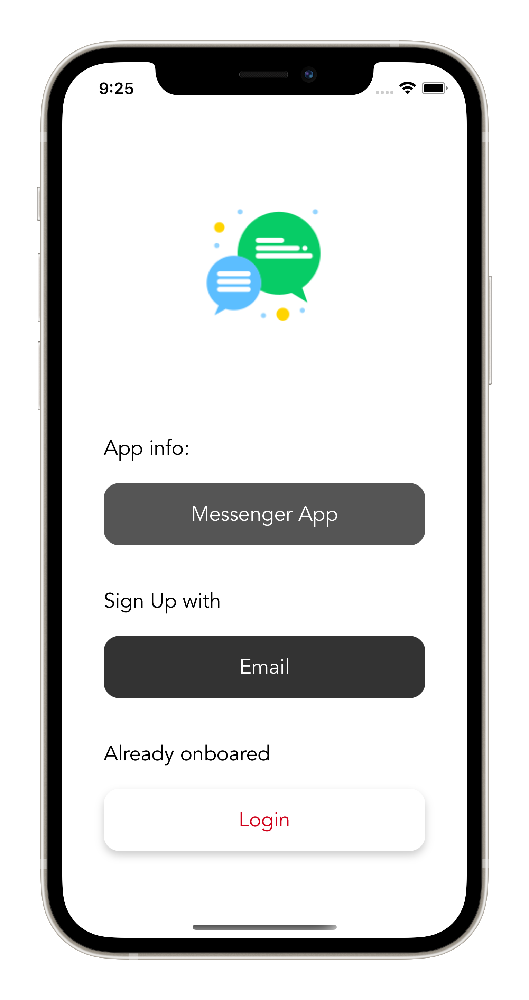
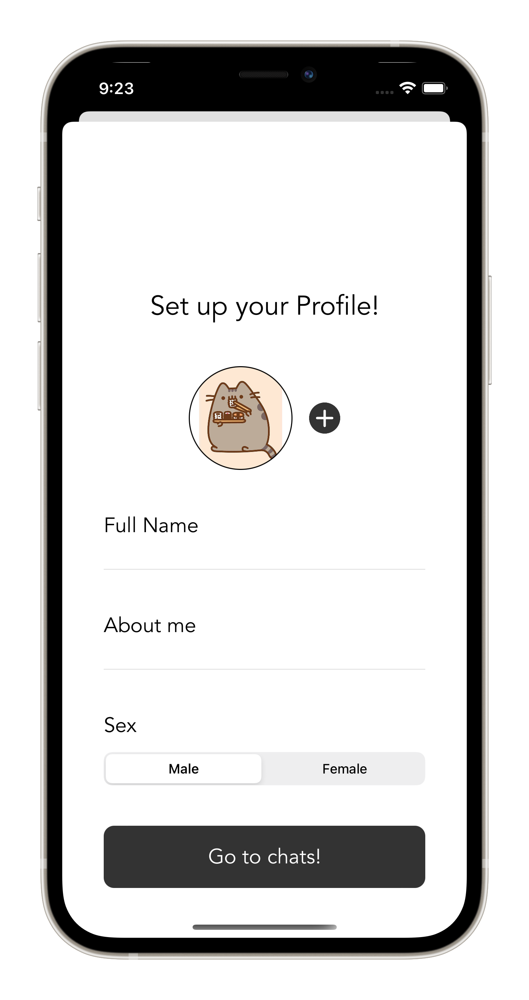
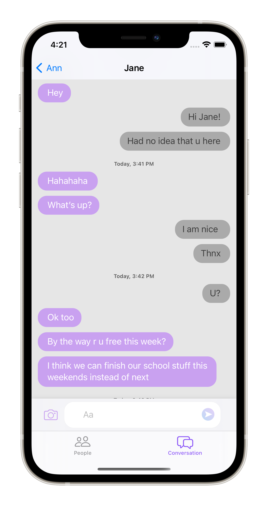

# MessengerApp
 
    

        iOS pet project application for real time chatting (text and images sending)
    

## Requirements
- IPhone 11+
- iOS 13.0+

## About
- UIKit
- Programmatically designed UI with NSLayoutConstraints
- MVC architecture
- SPM dependecies: SDWebImage, MessageKit, IQKeyboardManager, Firebase (FirebaseAuth, Firestore, FirebaseStorage)
- Users authentification and real time messaging functionality performed with Firebase services
- Real time chat view realised by means of MessageKit framework.

